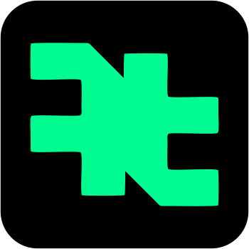

# 🕵️‍♂️ FundTracer by DT

<p align="center">
  
</p>

<p align="center">
  <strong>The Ultimate Blockchain Forensics & Sybil Detection Suite</strong><br>
  Trace recursive funding sources, visualize complex wallet networks, and detect coordinated bot activity in a flash.
</p>

<p align="center">
  <a href="#-key-features">Features</a> •
  <a href="#-cli-quickstart">CLI</a> •
  <a href="#-web-dashboard">Web Dashboard</a> •
  <a href="#-configuration">Setup</a> •
  <a href="#-supported-chains">Chains</a>
</p>

---

## ⚡ The V2 Speed Revolution

We've overhauled FundTracer to be the fastest forensics tool in the space. By integrating specialized APIs, we've reduced analysis time from **minutes to seconds**.

- **Instant Contract Profiling (Dune)**: Fetch thousands of interactors in <3s using Dune Analytics API. No more slow RPC scanning.
- **Batched Funding Lookups (Moralis)**: Trace recursive funding for 100+ addresses simultaneously using Moralis Batch API.
- **Deep Sybil Heuristics**: Our proprietary engine detects coordinated "Same-Block" movements, circular flows, and shared ancestor nodes.

---

## 🔥 Key Features

| Feature | What it does |
|---------|-------------|
| **Deep Funding Trace** | Recursively finds the ultimate source of funds (Exchanges, Mixers, or Seed Wallets). |
| **Sybil Detection** | Identifies shared funding sources between multiple wallets to catch "Airdrop Farmers". |
| **D3 Visualizations** | Interactive, force-directed graphs showing exactly how funds flow through the network. |
| **Risk Engine** | Automated 0-100 risk score based on 15+ "Vicious" patterns ( MEV bots, mixers, dust). |
| **Interactive CLI** | Full-featured terminal experience with ASCII art and interactive prompts. |

---

## 💻 CLI Quickstart

Get up and running in your terminal in under 60 seconds.

```bash
# Clone the repository
git clone https://github.com/Deji-Tech/fundtracer-by-dt.git
cd fundtracer-by-dt

# Install and build
npm install
npm run build

# Link CLI globally (optional)
cd packages/cli && npm link

# Start exploring!
fundtracer
```

### Common Commands
- `fundtracer analyze <address>`: Deep-dive into a single wallet.
- `fundtracer sybil <addr1> <addr2>`: Detect if wallets are related.
- `fundtracer config --set-key alchemy:KEY`: Add your API keys for unlimited usage.

---

## 🌐 Web Dashboard

For the full visual experience, run the FundTracer Dashboard locally:

1. **Start the API Server**:
   ```bash
   npm run dev:server
   ```
2. **Start the Vite App**:
   ```bash
   npm run dev
   ```
3. Open `http://localhost:5173` to see the live graph.

---

## ⚙️ Configuration

FundTracer works out of the box with default keys, but for production or heavy use, add your own providers in `packages/server/.env`:

| Variable | Provider | Purpose |
|----------|----------|---------|
| `ALCHEMY_API_KEY` | [Alchemy](https://alchemy.com) | Core transaction and block data (Required). |
| `MORALIS_API_KEY` | [Moralis](https://moralis.io) | Batched funding lookups (Recommended for Speed). |
| `DUNE_API_KEY` | [Dune](https://dune.com) | Instant contract interaction analysis. |

---

## ⛓️ Supported Chains

- ✅ **Ethereum Mainnet**
- ✅ **Linea** (Optimized for Airdrop farmers detection)
- ✅ **Arbitrum**
- ✅ **Base**
- ✅ **Optimism** 
- ✅ **Polygon** 

---

## 🛠️ Tech Stack

- **Engine**: TypeScript Core with Recursive Dependency Resolution.
- **Frontend**: React 18, Vite, D3.js (Force Layouts).
- **Backend**: Node.js, Express, Firebase (Auth/Analytics).
- **Styling**: Premium Glassmorphism & Cyberpunk Aesthetics.

---

## 📄 License

MIT © Built with ❤️ by **DT Development**
